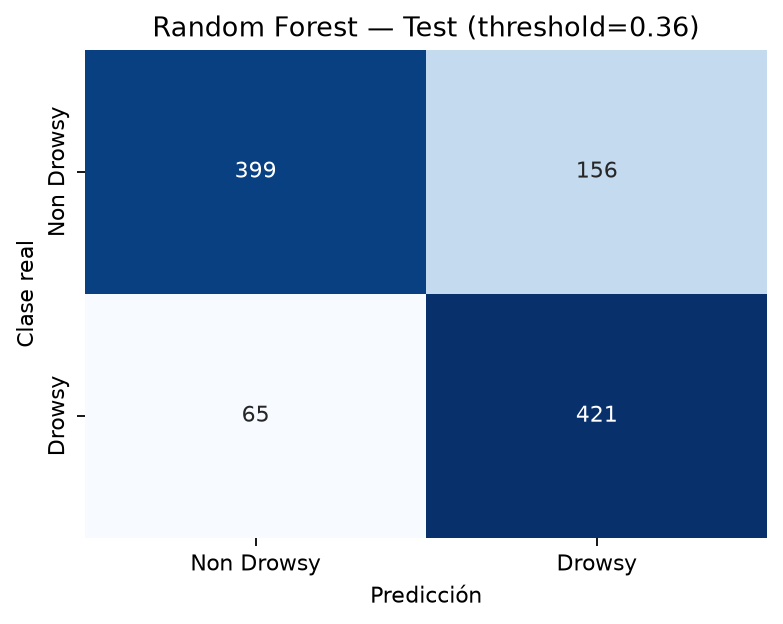
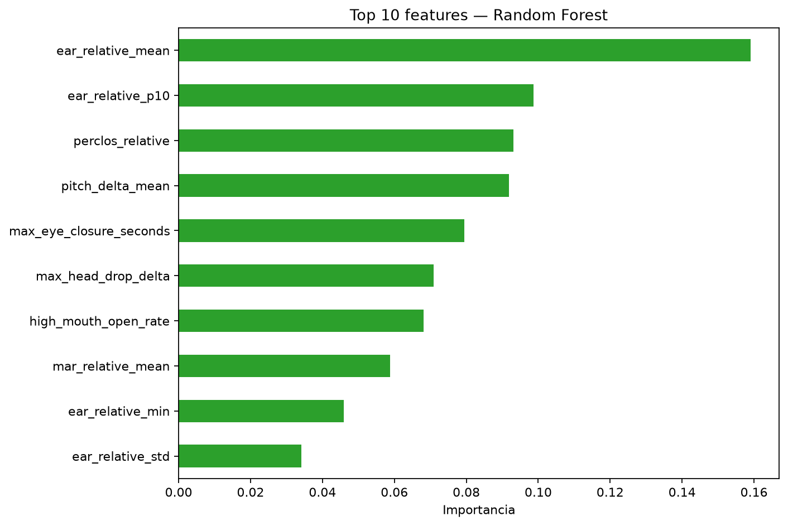

# FatigueGuard Mining

FatigueGuard Mining es un proyecto académico de maestría que detecta **patrones visuales
asociados con posible somnolencia** a partir del rostro del operador. El entregable integra
captura por webcam, calibración personal, extracción de landmarks, un modelo Random Forest,
persistencia SQLite y un tablero de monitoreo.

No es un dispositivo médico, no diagnostica somnolencia y no controla el vehículo. El prototipo
debe probarse sentado frente a un computador, nunca durante la conducción u operación real de
maquinaria.

## Arquitectura

```text
Webcam
  → MediaPipe Face Landmarker (~5 FPS)
  → calibración personal (30 s en condición alerta)
  → EAR, MAR y pose de cabeza relativos
  → ventana temporal de 10 s / 24 características
  → Random Forest / P(Somnolencia)
  → threshold 0.36 + persistencia 3 de 5
  → regla crítica: cierre bilateral continuo ≥ 4 s
  → estados, alerta sonora y episodios
  → SQLite
  → dashboard Streamlit
```

El dashboard no abre la cámara, no ejecuta MediaPipe y no realiza inferencia. Solo consulta la
base SQLite escrita por la aplicación realtime.

## Modelo final

El artefacto principal es `models/fatigueguard_landmarks_ml_best.pkl`:

- `RandomForestClassifier` con 300 árboles;
- 24 características faciales y temporales exactamente en el orden del entrenamiento;
- calibración individual de 30 segundos;
- procesamiento aproximado a 5 FPS;
- ventanas de 10 segundos;
- threshold `0.36`, seleccionado exclusivamente con Validation;
- alerta del modelo con al menos 3 decisiones positivas entre las últimas 5;
- alerta crítica independiente ante cierre ocular bilateral continuo de al menos 4 segundos.

Random Forest y XGBoost fueron comparados con separación estricta por sujeto. Random Forest
ofreció el mejor equilibrio y fue seleccionado. XGBoost se conserva únicamente como comparador
académico dentro del notebook 09.

| Modelo/evaluación | Accuracy | Recall | Precision | F1 | FNR | FPR | ROC-AUC |
|---|---:|---:|---:|---:|---:|---:|---:|
| Random Forest, threshold validado 0.36 | 0.7877 | 0.8663 | 0.7296 | 0.7921 | 0.1337 | 0.2811 | 0.8508 |
| XGBoost, threshold 0.50 | 0.7589 | 0.6667 | 0.7845 | 0.7208 | 0.3333 | 0.1604 | 0.8335 |





## Estados operativos

- `CALIBRANDO`: recopila referencias personales mientras el usuario permanece alerta.
- `NORMAL`: no existe persistencia suficiente de señales asociadas con somnolencia.
- `POSIBLE SOMNOLENCIA`: una o dos decisiones recientes superan el threshold.
- `ALERTA`: al menos 3 de las últimas 5 decisiones son positivas o se activa la regla crítica.

La interfaz realtime muestra además mensajes de calidad cuando no detecta el rostro o el buffer
no contiene suficientes mediciones válidas.

### Refinamiento en curso

La regla `3 de 5` corresponde al funcionamiento actual, pero se considera provisional. Como las
ventanas de 10 segundos se solapan, un mismo movimiento normal puede aparecer en varias decisiones
seguidas y producir alarmas repetidas. La siguiente iteración probará una mediana de probabilidades
recientes, confirmación ocular, tiempos mínimos para entrar y salir de cada estado y una sola alarma
por episodio. Estos parámetros se validarán con sesiones nuevas y no con el conjunto Test.

## Estructura del repositorio

```text
FatigueGuard_Mining/
├── README.md
├── requirements.txt
├── requirements-notebooks.txt
├── src/
│   ├── config.py
│   ├── database.py
│   ├── facial_features.py
│   └── realtime_fatigueguard.py
├── dashboard/
│   └── app.py
├── models/
│   ├── fatigueguard_landmarks_ml_best.pkl
│   └── mediapipe/face_landmarker.task
├── notebooks/
│   ├── 08_landmarks_feature_engineering.ipynb
│   └── 09_ml_landmarks_xgboost.ipynb
├── outputs/
│   ├── figures/
│   └── metrics/
├── data/
│   └── README.md
├── scripts/
│   └── init_db.py
└── tests/
```

Los datasets, datos procesados, eventos personales, SQLite, cachés y `local_archive/` no se
versionan.

El [informe final del proyecto](docs/Entrega%202.docx) describe el tratamiento de los datos, las
24 características temporales, los resultados y la propuesta de refinamiento de la aplicación y
del tablero.

## Requisitos

- Windows, Linux o macOS con Python 3.12 recomendado.
- Webcam accesible mediante OpenCV.
- Entorno con interfaz gráfica para mostrar la ventana realtime.

## Instalación

Ejemplo con Windows PowerShell:

```powershell
git clone <URL_DEL_REPOSITORIO>
cd FatigueGuard_Mining
python -m venv .venv
.\.venv\Scripts\Activate.ps1
python -m pip install --upgrade pip
pip install -r requirements.txt
```

La ejecución del artefacto final no necesita descargar UTA-RLDD.

## Ejecutar la aplicación realtime

```powershell
python -m src.realtime_fatigueguard --equipment-id CAMION_01
```

Si la cámara principal no corresponde al índice 0:

```powershell
python -m src.realtime_fatigueguard --camera 1 --equipment-id CAMION_01
```

Durante los primeros 30 segundos mantenga una postura normal, ojos abiertos de forma natural y
expresión neutral. La calibración estima de manera robusta `EAR_base`, `MAR_base`, `pitch_base`,
`yaw_base` y `roll_base`. Si hay menos de 120 frames faciales válidos, el periodo se extiende.

Presione `Q` para finalizar. Los episodios abiertos se cierran correctamente antes de salir.

## SQLite y verificación de eventos

La base se crea automáticamente en `data/fatigueguard.db`. También puede inicializarse sin abrir
la webcam:

```powershell
python scripts/init_db.py
```

Para generar un evento durante una prueba segura, complete la calibración sentado frente al
computador y mantenga ambos ojos cerrados durante más de cuatro segundos. La regla crítica debe
mostrar `ALERTA` y registrar `PROLONGED_EYE_CLOSURE`.

Para comprobar desde Python que SQLite recibió el episodio:

```powershell
python -c "from src.database import get_recent_events; print(get_recent_events(5))"
```

## Ejecutar el dashboard

En otra terminal, con el mismo entorno activado:

```powershell
streamlit run dashboard/app.py
```

Pulse **Actualizar** después de producir un evento. El dashboard mostrará sesión, equipo, estado,
probabilidad, decisiones positivas recientes, última actualización, alertas y episodios. Ambas
aplicaciones deben ejecutarse desde el mismo clon para compartir `data/fatigueguard.db`.

## Dataset y reproducción del entrenamiento

Se utilizó **UTA-RLDD Face Cropped Video**, variante `len60`. Se encontraron 60 sujetos y se
utilizaron 59; el sujeto 42 fue excluido por ausencia de una de las clases requeridas. Los datos
originales no están incluidos por tamaño. Consulte [data/README.md](data/README.md) para la
estructura y las instrucciones de descarga manual.

Para reproducir el trabajo académico:

```powershell
pip install -r requirements-notebooks.txt
jupyter lab
```

Ejecute en orden:

1. `notebooks/08_landmarks_feature_engineering.ipynb`: aplica el split 41/9/9 versionado, reserva
   30 segundos de calibración por sujeto y genera las ventanas con 24 características.
2. `notebooks/09_ml_landmarks_xgboost.ipynb`: compara Random Forest y XGBoost y reconstruye el
   artefacto final.

El notebook 09 requiere el archivo `data/processed/uta_rldd_landmark_windows.csv` producido por
el notebook 08. Ningún notebook debe crear un split alternativo.

## Pruebas

Las pruebas no abren la webcam:

```powershell
python -m unittest discover -s tests -v
python -m src.realtime_fatigueguard --self-test
```

Verifican el modelo, las 24 características, configuración, regla 3/5, cierre ocular de cuatro
segundos, MediaPipe, SQLite y lectura para el dashboard.

## Limitaciones

- El desempeño procede de un dataset controlado y puede disminuir con iluminación minera,
  vibración, gafas, oclusiones, cámaras distintas y sujetos fuera del dominio de entrenamiento.
- La calibración supone que el operador permanece alerta durante los primeros 30 segundos.
- La variabilidad entre sujetos sigue siendo relevante.
- El threshold no debe reajustarse usando pruebas manuales ni datos de Test.
- Un evento visual asociado con somnolencia no constituye diagnóstico clínico.
- El prototipo no sustituye políticas de seguridad, supervisión humana ni sistemas certificados.
